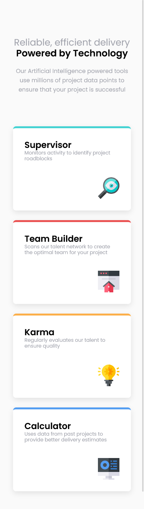
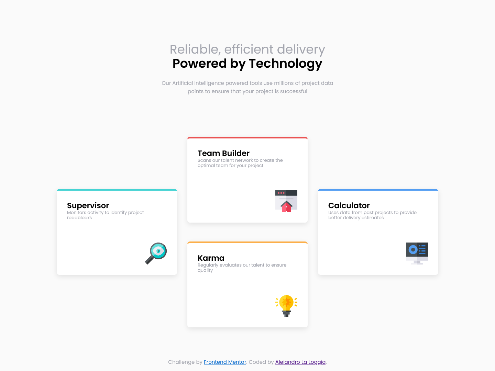

# Frontend Mentor - Four card feature section solution

This is a solution to the [Four card feature section challenge on Frontend Mentor](https://www.frontendmentor.io/challenges/four-card-feature-section-weK1eFYK). Frontend Mentor challenges help you improve your coding skills by building realistic projects. 

## Table of contents

- [Overview](#overview)
  - [The challenge](#the-challenge)
  - [Screenshot](#screenshot)
  - [Links](#links)
- [My process](#my-process)
  - [Built with](#built-with)
  - [What I learned](#what-i-learned)
  - [Useful resources](#useful-resources)
- [Author](#author)

## Overview

### The challenge

Users should be able to:

- View the optimal layout for the site depending on their device's screen size

### Screenshot




### Links

- Solution URL: [Github](https://github.com/AlejandroLaLoggia/four-card-feature-section)
- Live Site URL: [Github page](https://alejandrolaloggia.github.io/four-card-feature-section/)

## My process

### Built with

- Semantic HTML5 markup
- CSS custom properties
- CSS Grid
- Mobile-first workflow
- Figma

### What I learned

It was a good practice for display grid and I learned how to use grid-area, apply the scale property on hover for a visual effect for the first time.

```css
.super{
        grid-area: 2 / 1 / 4 / 2;
    }

.card:hover{
        transform: scale(1.05);
        transition: 0.3s;
    }

```


### Useful resources

- [Scale Hover](https://www.w3schools.com/howto/howto_css_zoom_hover.asp) - Apply this for hover card.
- [Grid-area repository](https://github.com/eldesha19/Four-card-feature-section/blob/main/README.md) - use this code to understand the use of grid-area with your columns and rows. Delete all the lines, leaving only the grid.

## Author

- Frontend Mentor - [@AlejandroLaLoggia](https://www.frontendmentor.io/profile/AlejandroLaLoggia)


